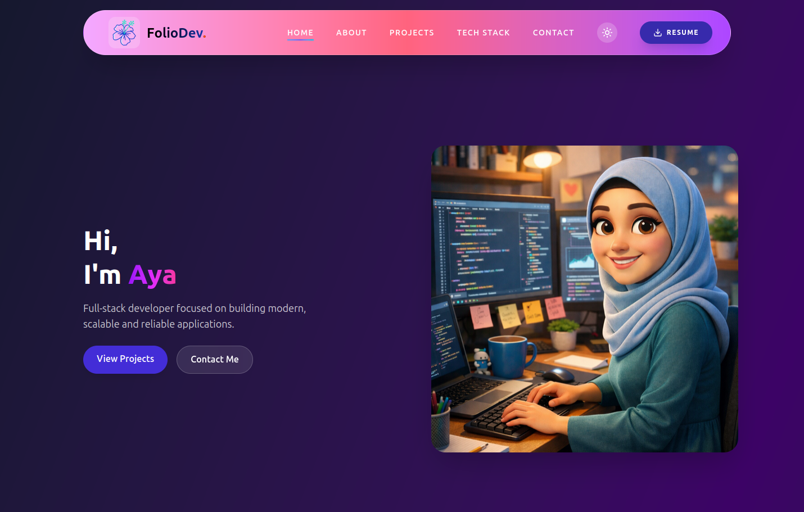

# 🌐 Personal Portfolio - React + Vite + TailwindCSS

This is my personal developer portfolio built to showcase my projects, skills, and experience as a full-stack developer.

It is built with modern web technologies to ensure performance, responsiveness, and a clean UI/UX experience.

---

## 🚀 Tech Stack

- React.js
- Vite
- TailwindCSS
- EmailJS (contact form)

---

## ✨ Features

- Fully responsive design (mobile / desktop)
- Modern and clean UI
- Smooth navigation between sections
- Projects showcase section
- Functional contact form using EmailJS
- Fast performance with Vite
- Automatic deployment via Netlify

---

## 📦 Installation & Setup

Clone the repository:

```bash
git clone https://github.com/aelk-dev/portfolio-dev.git
```

## Go to the project folder:

```bash
cd portfolio-dev
```

## Install dependencies:

```bash
npm install
```

## Run the development server:

```bash
npm run dev
```

---

## Create a .env file in the root directory:

- VITE_EMAILJS_SERVICE_ID=your_service_id
- VITE_EMAILJS_TEMPLATE_ID=your_template_id
- VITE_EMAILJS_PUBLIC_KEY=your_public_key

---

## website screen



---

## Author

- Name: Aya
- GitHub: https://github.com/aelk-dev/portfolio-dev
- Portfolio: https://foliodev-aya.netlify.app/

---

## License

This project is open-source and available for learning purposes.
